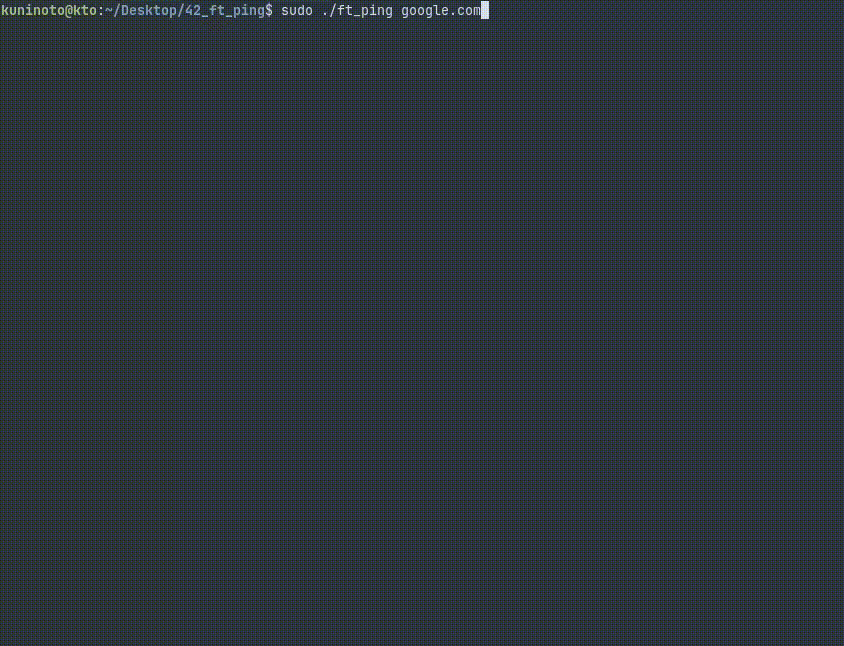

# 42_ft_ping (42Porto - Advanced Cursus)

### Demonstration



### Options
| Option | Default | Description |
|--------|---------|-------------|
| `-a` | false | use audible ping |
| `-c <count>` | 0 | stop after `<count>` replies |
| `-D` | false | print timestamps |
| `-d` | false | use `SO_DEBUG` socket option |
| `-f` | false | flood ping |
| `-h`, `-?` | false | print help and exit |
| `-i <interval>` | 1 | wait `<interval>` seconds between sending each packet |
| `-l <preload>` | 0 | send `<preload>` packets as fast as possible before falling into normal mode of execution |
| `-n` | false | no reverse DNS name resolution |
| `-p <pattern>` | 0x0 | content of padding bytes |
| `-q` | false | quiet output |
| `-r` | false | ignore routing |
| `-t <ttl>` | 64 | IP time to live |
| `-v` | false | verbose output |
| `-V` | false | print version and exit |
| `-s <size>` | 56 | packet's payload size |
| `-w <deadline>` | 0 | stop after `<deadline>` seconds |
| `-W <timeout>` | 10 | wait `<timeout>` seconds for response |

### Installation:
1. Install required dependencies:
```bash
sudo apt-get install cc make
```

2. Clone this repository and navigate to its folder
```bash
git clone https://github.com/Kuninoto/42_ft_ping ft_ping && cd ft_ping
```

3. Build and run (requires root privileges to user socket RAW)
```bash
make && sudo ./ft_ping [options] <destination>
```

### License

This project is licensed under the GPL3 license - see the [LICENSE](LICENSE) file for more details.

---
Made by Nuno Carvalho (Kuninoto) | nnuno-ca@student.42porto.com  
<div id="badge"> <a href="https://www.linkedin.com/in/nuno-carvalho-218822247"/> &nbsp;
